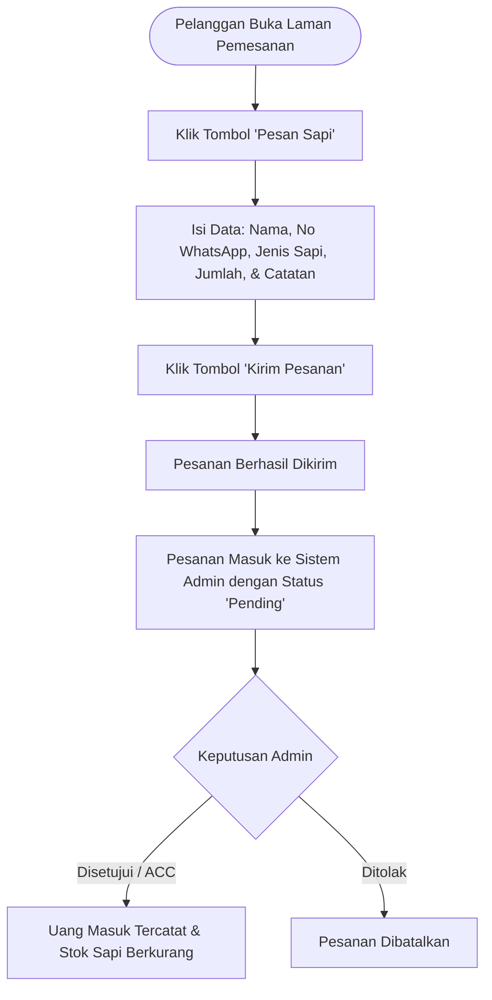

# Flowchart SiakTernak Management Pro (Client-Ready Version)

Dokumen ini berisi flowchart alur penggunaan aplikasi yang mudah dipahami oleh Klien / Pengguna Umum, berfokus pada **apa yang dilakukan pengguna** dan **fitur apa saja yang bisa digunakan** tanpa istilah teknis database atau pemrograman.

---

## 1. Alur Utama Penggunaan Aplikasi

```mermaid
graph TD
    %% --- MASUK KE APLIKASI ---
    START([Aplikasi Dibuka]) --> LOGIN_PAGE[Halaman Login Admin]
    LOGIN_PAGE --> INPUT_LOGIN[Input Username & Password]
    INPUT_LOGIN --> BTN_LOGIN{Klik Tombol 'MASUK'}
    
    BTN_LOGIN -->|Gagal| ERR_LOGIN[Tampilkan Peringatan Salah] --> LOGIN_PAGE
    BTN_LOGIN -->|Berhasil| DASHBOARD[Masuk ke Halaman Utama Admin]

    %% --- NAVIGATION ---
    DASHBOARD --> NAV_HEADER[Menu Profil & Logout]
    DASHBOARD --> NAV_TABS[Pilih 5 Menu Utama]

    %% --- PROSES ADMIN PROFILE ---
    NAV_HEADER --> OPT_PROFILE[Kelola Profil Admin]
    NAV_HEADER --> OPT_LOGOUT[Keluar Aplikasi / Logout] --> LOGIN_PAGE
    
    OPT_PROFILE --> P1[Ubah Password]
    OPT_PROFILE --> P2[Daftarkan Admin Baru]
    OPT_PROFILE --> P3[Lihat & Hapus Anggota Admin]

    %% --- TAB 1: BERANDA ---
    NAV_TABS -->|Menu 1| TAB_BERANDA[Beranda / Dashboard]
    TAB_BERANDA --> B1[Lihat Estimasi Laba Bersih]
    TAB_BERANDA --> B2[Lihat Total Pemasukan & Pengeluaran]
    TAB_BERANDA --> B3[Lihat Grafik Keuangan Bulanan]
    B3 -->|Klik Grafik| B4[Lihat Rincian Laba Rugi Bulanan]

    %% --- TAB 2: DATA PEMBELI ---
    NAV_TABS -->|Menu 2| TAB_PEMBELI[Data Pembeli / Pesanan]
    TAB_PEMBELI --> C1[Lihat Daftar Pesanan Sapi Masuk]
    C1 --> C2{Status Pesanan?}
    
    C2 -->|Sudah Diproses| C3[Lihat Status: Disetujui / Ditolak]
    C2 -->|Baru / Pending| C4[Klik Tombol ACC atau TOLAK]
    
    C4 -->|Pilih ACC| C5[Pesanan Disetujui]
    C5 --> C5_1[Otomatis Mencatat Uang Masuk]
    C5 --> C5_2[Otomatis Mengurangi Stok Sapi Fisik]
    
    C4 -->|Pilih TOLAK| C6[Pesanan Ditolak]

    %% --- TAB 3: DATA TRANSAKSI ---
    NAV_TABS -->|Menu 3| TAB_DATA[Data Transaksi]
    TAB_DATA --> D1[Pilih Lihat Tabel Pemasukan / Pengeluaran]
    
    TAB_DATA --> D2[Tambah Transaksi Baru - Klik Tombol '+']
    D2 --> D2_1[Catat Pemasukan / Pengeluaran Baru]
    
    TAB_DATA --> D3[Ubah / Hapus Transaksi - Klik Baris Tabel]
    
    TAB_DATA --> D4[Unduh Laporan Excel - Klik 'Export Excel']
    TAB_DATA --> D5[Lihat Riwayat Transaksi Terbaru - Klik 'Riwayat']

    %% --- TAB 4: INVENTARIS ---
    NAV_TABS -->|Menu 4| TAB_INVENTARIS[Inventaris Barang & Ternak]
    TAB_INVENTARIS --> E1[Lihat Jumlah Stok Real-Time: Sapi, Pakan, Obat]
    TAB_INVENTARIS --> E2[Lihat Tabel Keluar-Masuk Stok Barang]
    
    TAB_INVENTARIS --> E3[Tambah Mutasi Stok Manual - Klik Tombol '+']
    TAB_INVENTARIS --> E4[Ubah / Hapus Catatan Stok Manual]

    %% --- TAB 5: KEUANGAN ---
    NAV_TABS -->|Menu 5| TAB_KEUANGAN[Modul Laporan Keuangan SAK ETAP]
    TAB_KEUANGAN --> F1[Lihat Daftar Akun / COA]
    TAB_KEUANGAN --> F2[Lihat Jurnal Umum - Catatan Akuntansi Otomatis]
    TAB_KEUANGAN --> F3[Lihat Buku Besar - Alur Kas Masuk/Keluar per Akun]
    TAB_KEUANGAN --> F4[Lihat Neraca Saldo - Keseimbangan Keuangan]
    TAB_KEUANGAN --> F5[Lihat Laporan Laba Rugi Standar Akuntansi]
```

---

## 2. Alur Pembelian Sapi oleh Pelanggan (Self-Service)

Flowchart ini menjelaskan bagaimana pelanggan melakukan pemesanan sapi secara mandiri hingga pesanan tersebut diproses oleh admin peternakan:

